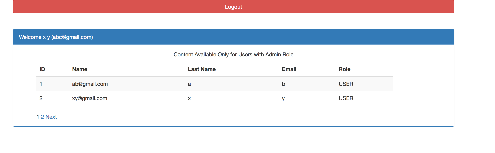
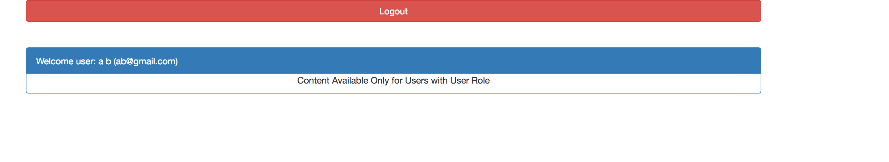

# LoginRegistration_SpringBoot
A Simple Registration and User based login that is implemented in Spring Boot.
As per the need I have created two user group one is normal user and another is Admin. Admin has the priviledge to view the all users.
Here Spring Security is used for authentication and authorization purposes.

SCREENSHOTS:-
 

        </img>
        </img>
        </img>
        </img>

